<div align="center">

# Taiyabah Masjid

**The masjid's own prayer times, notices, Qur'an and services — in one app,<br/>offline, in four languages.**

Bolton Central Islamic Society · Registered charity 1041569
31a Draycott Street, Bolton BL1 8HD


[**Open the app →**](https://taiyabahapp.ysbdesigns.uk)

</div>

<br/>

> [!NOTE]
> **Reading this without a technical background?** Start at *The problem*, *What
> the app is* and *One Friday, end to end*. Those three explain what this is and
> what it does for the congregation. Everything after *How the pieces actually
> fit* is for whoever maintains it.

### How to read the diagrams

Every picture in this file uses the same four colours, and they always mean the
same thing. The connectors animate, so you can see which way the information
actually travels.

| | Means |
| :--- | :--- |
| ⬛ **Deep plum, gold border** | This repository — our code, the masjid's own data |
| 🟩 **Pale green** | Live, in the congregation's hands today |
| 🟨 **Sand, dashed border** | In development — not built, and not described as built |
| ⬜ **Stone** | A person, or something outside the app |

---

## The problem, in one picture

Somebody wants to know when Jumuʿah is. Before this app there were four places
to look and no way to tell which one the masjid had actually said.


The point is not that an app is nicer. It is that **the times are the masjid's
own published timetable and nothing else.** There is no calculation engine in
this repository. A third-party app can be excellent and still be wrong here,
because it is answering a different question: what the astronomy says, rather
than what this masjid prints on its board.

---

## What the app is

Four tabs, and a menu that opens in place rather than taking you somewhere else.


> [!IMPORTANT]
> **Two things carry the "in development" tag, and they stay tagged until they
> are real.** *Membership status* publishes what membership is and when the fee
> falls due, but is not wired to the committee's members list, so it cannot tell
> an individual whether **they** have paid. *Recordings* — past bayaans inside
> the app's own player — waits on written permission from eMasjid Live, whose
> infrastructure holds the archive. The live stream itself works today.
>
> Nothing else is tagged. Before adding or removing a tag anywhere, check what
> the code does rather than what this file says.

It installs to the home screen, works with no signal, and is also on **Google
Play** as a Trusted Web Activity over the same URL — one codebase, not two.

---

## One Friday, end to end

The clearest way to explain the app is to follow a single Friday: a reminder
sent at nine, a timetable that rearranges itself, and two automatic alerts
before the jamāʿah.



> [!TIP]
> **The cross-check in the middle is the part worth knowing.** The app shows
> times embedded in `index.html`; the reminder scheduler reads
> `data/timetable-2026.json`. Both are generated from the same source, but a
> refresh that updated one and not the other would announce a time nobody can
> see. So every scheduled run compares the two before sending — and halts with a
> logged discrepancy rather than guessing.

---

## How the pieces actually fit

Three things are deliberately kept apart: the files the phone runs, the database
that holds requests, and the one place a secret is allowed to exist.



> [!CAUTION]
> **The Supabase `service_role` key must never appear in this repository**, in
> `index.html`, or anywhere else a browser can reach it. It bypasses Row Level
> Security entirely. It exists in exactly one place — Cloudflare's secret store —
> where the Worker uses it to write a notice. The OneSignal REST key can message
> the entire congregation and lives in the same one place: never in the
> repository, never in `admin.html`, never in a browser.
>
> If GitHub's secret scanning ever blocks a push, **do not click "Allow
> secret."** Cancel, remove the key, rotate it.

The **publishable** key is in the app, and that is fine: Row Level Security is
the real access control. With it the app can write a hall booking, a nikāḥ
request or a request for the imam's advice, and read the notices view,
availability and term dates. It cannot read any of those requests back, and it
cannot write a notice. That was verified by querying as the `anon` role, not
inferred from the grants.

Hall bookings, nikāḥ requests, advice requests and notices all live in the same
Supabase project the **masjid's website** uses, so a request made in the app
lands in the same queue the office already works from. `db/001_notices.sql` is
this repository's own migration, applied by hand to the shared project.
Everything else in that schema belongs to the website repository.

---

## The prayer timetable

Generated, never hand-entered, and never calculated.


Current dataset: **1 January – 31 December 2026** (1447–1448 AH).

> [!WARNING]
> **The 2027 timetable is the one dated job in this repository, and it cannot
> be done here.** It needs the masjid's own published timetable; prayer times
> are never calculated and never invented. On 1 January 2027 the embedded
> dataset runs out, the app falls to its "timetable ended" state, and the
> automatic jamāʿah and Sūrah al-Kahf reminders stop. The masjid publishes the
> following year's around late November.

**This used to say the Worker "fetches `data/timetable-2027.json`, finds
nothing" — it did not.** `TIMETABLE_URL` was a constant naming the 2026 file,
which still exists on 1 January, so the fetch succeeded, today's date simply
was not in it, and the run returned `{ skipped: "no timetable entry for …" }`
every minute for ever. The failure was quieter than the document describing it.

Three things now make it loud, because the day it matters nobody will be
reading this file:

- the Worker asks for **the year it is actually in**, and treats running past
  the end of the dataset as a halt to be logged, not a minute with nothing due
- **`/api/health` reports the timetable's last date and the days left**, so the
  question has an answer somebody can go and look at
- **the trustee screen draws a banner** — amber from 60 days out, red once it
  has run out — because a trustee opens `admin.html` and nobody opens a
  Cloudflare log

### Annual refresh

The year is an argument now, so nothing in the pipeline is edited:

1. Put the new rows in `data/raw_timetable_<year>.txt`, in the existing format.
2. Copy `data/year-2026.json` to `data/year-<year>.json` and fill in the two
   things only the printed board can tell you: the Hijri year on 1 January, and
   a few hand-checked days. **Do not guess either** — the script refuses to run
   without them, and a day count does not catch a year read the American way
   round.
3. `python3 data/parse_timetable.py <year>` — it verifies and writes nothing at
   all on any failure.
4. Embed the generated JSON into `index.html`, replacing the `const DATA` block.
5. Commit `data/timetable-<year>.json` too — the scheduler reads it, and the
   cross-check halts reminders if the two ever disagree.
6. Complete the sign-off in `data/VERIFICATION.md`, checking the generated times
   against the printed board, before deploying.

Step 6 is not optional. Automated checks confirm internal consistency; only a
person can confirm it matches what the masjid intends.

> [!NOTE]
> The refactor that made the year an argument was proved by rebuilding 2026
> with it: the output is byte-identical to the committed file. The guards were
> proved by breaking them — no year, a missing `year-<year>.json`, spot checks
> belonging to another year, and a config with no spot checks at all.

---

## Every preference in one tag

This is the single most important constraint in the notification code, and the
one most likely to be broken by a well-meaning change.



> [!IMPORTANT]
> **`PREF_ORDER` is positional and append-only.** Inserting a preference in the
> middle, or reordering it, does not break a build — it silently reassigns the
> meaning of every value already stored on every subscriber's device. Somebody
> who asked only for janāzah alerts would start receiving everything, or stop
> receiving anything. New preferences go **on the end**. A release check holds
> the order, and holds `index.html` and the Worker to the same names.

The obvious design gives each preference its own tag. That was built, and
OneSignal answered `409 entitlements-tag-limit`. Hence one tag, `p`.

### Notices

A notice is a send *and* a record, in that order: `admin.html` posts to the
Worker, the Worker uploads the poster to the Supabase `notices` bucket, inserts
the row through `publish_notice()`, then sends the notification — with the
poster as `big_picture` on Android, `ios_attachments` on iOS and
`chrome_web_image` on desktop. The notification body is truncated on a word
boundary at 180 characters; the full text is in the notice.

> [!NOTE]
> **`/api/test-reminders` is not a test.** It runs the real send path against
> real subscribers. It is safe only in the sense that the scheduler's own
> deduplication stops a reminder going out twice for the same prayer — if one is
> genuinely due when you press it, it goes out. It also covers the jamāʿah
> reminders only, not the Friday al-Kahf one.
>
> **iOS:** web push only reaches devices where the app has been **added to the
> Home Screen**. A bookmarked tab receives nothing. That is an Apple
> restriction, and it is what makes install instructions part of the feature.

---

## Getting a new build onto an installed phone

Worth understanding before changing anything, because it is subtle and it has
bitten this app twice.


The app's `start_url` is `index.html`, which the service worker serves from its
own cache. **The code a phone runs is the code cached when that cache was
written** — not what is on the server. Bump `CACHE` in `sw.js` with every
user-visible change. It is one line, and it is the difference between shipping
and appearing to ship. Current: `taiyabah-v164`.

---

## What the app does

**Home**
- The app opens on a home screen rather than the timetable: the next jamāʿah and
  its countdown, today's five prayers, the day's reminder, a link to the
  broadcast, and a grid of the services people actually come looking for
- Four tabs — Home, Prayer Times, Notices and More. "More" opens the full menu
  in place rather than navigating away from where you are
- The Android Back button closes one layer at a time. In a Trusted Web Activity
  Back is `history.back()`, and until v164 nothing in the app had ever pushed a
  history entry, so Back left the start URL — which finishes the activity. Back
  with nothing open still leaves the app; this makes Back work, it does not trap
  anybody

**Prayer times**
- Beginning and jamāʿah times for all five prayers, from the masjid's own
  published timetable
- Live countdown to the next jamāʿah, with the current prayer highlighted from
  its *beginning* time rather than its jamāʿah
- Both Jumuʿah times shown inline on Fridays, with Jumuʿah replacing Zuhr in the
  timetable and the day's heading
- Browse any date, jump to Today or the next Jumuʿah, or open the full month
- A Friday-only call to give, paired with an authentic hadith on the day's virtue

**Reminders on screen**
- Contextual cards tied to the day and time — Sūrah al-Kahf on Fridays, morning
  and evening adhkār in their true windows, duʿā between adhān and iqāmah
- Advance notice of voluntary fasts *the day before*, with the suhūr end time
  computed from the next day's Fajr
- The Islamic calendar days the masjid's own timetable marks
- A quiet countdown to Ramadan, appearing only in the final 30 days

**Notifications**
- Opt-in by category — jamāʿah reminders, janāzah, announcements, events and the
  Friday Sūrah al-Kahf reminder — so urgent messages stay urgent
- **Two automatic alerts per prayer**: an advance reminder at each subscriber's
  own lead time (5/10/15 min), and **"Jamāʿah Time Now"** at the jamāʿah itself
- **Sūrah al-Kahf, every Friday at 9am**, on its own switch and on by default
- **Notices carry a poster**, shown in the notification itself on Android, iOS
  and desktop, and kept in the Notices tab afterwards
- A trustee compose screen (`admin.html`), password-protected, sending through
  the masjid's own Cloudflare Worker
- Built-in diagnostics ("Having trouble?") so notification problems are
  self-serviceable rather than a support conversation

**Recite**
- **Qur'an** — two ways to read, chosen on opening:
  - **English Translation** — the complete Mus-haf in IndoPak script: 114 sūrahs,
    6,236 āyāt, with the official tajweed colour legend. Split by sūrah and
    fetched only when opened, then cached, so a sūrah read once can be read again
    in the masjid basement with no bars
  - **13-Line Qur'an** — the familiar Indo-Pak page for ḥifẓ, all 848 of them.
    Jump by sūrah, juz or page number; it remembers where you were. Pages are
    lossless grayscale WebP at about 78 KB each, fetched one at a time with the
    neighbours prefetched
- **Ṣaḥīḥ al-Bukhārī** — browsable by its **97 books**, each named, opening on
  the list rather than on hadith 1. Every hadith shows the number people cite
  (the standard numbering to 7,563) alongside its place within its book. Jump to
  a cited number, or search the Arabic without typing diacritics. **Arabic only,
  and no commentary** — the screen says both; see *Third-party data* for why
- **Daily Athkar** — morning and evening remembrance, after every ṣalāh and
  before sleep, each sourced and cited
- **Common Duas** — 76 everyday supplications in a tile grid across 12 headings.
  The ones that come from hadith are not transcribed: they are lifted
  word-for-word out of the Arabic of the six books, by collection, hadith number
  and word span (`scripts/build-hadith-duas.mjs`)
- **40 Rabbanā** — the forty short Qur'anic duʿās, numbered, in IndoPak script,
  every one verified against the Qur'an text itself rather than transcribed

**Qibla**
- Great-circle bearing to the Kaʿbah with a live compass where supported,
  refining to the user's own location if allowed
- Degrades honestly: states the bearing even without a working compass, and
  explains exactly why the compass can't run when it can't

**Listen live**
- In-app player for the masjid's broadcast, with background playback and
  lock-screen controls
- The masjid's videos and bayaans, playing in-app rather than sending people away

**Zakat calculator**
- Nisab from a live gold/silver spot price, fetched key-free and sanity-checked,
  falling back to manual entry if the figure looks implausible
- Silver standard by default — the Hanafi position, being the lower threshold
- Plain-English guidance written for someone who has never calculated zakat, and
  it states plainly that it is a guide, not a ruling

**Giving**
- Card, Apple Pay and Google Pay through the masjid's own **Stripe** payment
  links, with Gift Aid — money reaches the charity directly, with no shop
  platform in between
- Donor tiers as **pledges**, settled afterwards by transfer or at the office
- Bank details with tap-to-copy

**The madrasah**
- **Admissions & Fees** — everything asked of a family before they apply: the
  fees, the class times, the 90% attendance the madrasah expects and what happens
  below it, the uniform rule, and that applying is not the same as having a place
- **Holiday Planner** — whether the madrasah is open *today*, twelve month grids
  that open on the month you are in, every closure of the 2026/27 year with its
  length, and the Islamic dates beside them. Calculated dates are labelled
  estimates; the madrasah's own closures are not, because they are fixed
- **Madrasah Portal** — sign-in for parents, teachers and staff, on the masjid's
  website

**Life-stage services**
- **Birth** — guidance for new arrivals, including circumcision referral
- **Nikāḥ** — what the masjid provides, the standing advice to also register the
  marriage civilly, and a date request: pick a day and the prayer it would
  follow, with that day's own jamāʿah time shown beside it
- **Islamic Will** — wasiyyah, the fixed shares, and where a solicitor is needed
- **Funeral Services** — BCoM's out-of-hours number first, because that call has
  to happen before anything else can, then everything the masjid itself arranges:
  ghusl, kafn, janāzah, transport, the fridge, burial, catering and the imams
  afterwards

**Hall hire and education**
- **Hall / Room Hire** — the diary read live from the masjid's booking system, so
  free days are visible before anybody is asked. Whole-day hire on the masjid's
  own rate card, member and non-member, with the weekend rate applying Friday to
  Sunday and the single-hall option withdrawn on those days. The request is
  submitted from the app and the date held while the deposit is paid through
  Stripe
- **Education** — Arabic classes and the Ghusl workshop, for adults

**The imam's advice**
- A congregant writes to the imam from the app, giving their name, phone and
  email so he can answer. The request lands in the **admin portal** under an
  `imam` role on the masjid's website — there is no imam mailbox to maintain and
  no address published for anyone to harvest
- The office is alerted that something is waiting, the imam reads and answers it
  in the portal, and the answer is emailed to the person who asked
- Nothing is read back into the app: the congregant has no login, so the reply
  cannot be a screen

**Charity collections**
- A registered charity can request a collection at the masjid, uploading its BMCC
  certificate with the request. The certificate is checked against the same three
  months the database enforces, and both agreements are read from their
  checkboxes rather than assumed

**Notices**
- Everything the masjid has announced, newest first, each with its date and the
  poster if one was attached. Tapping a poster opens it full-screen
- The list is cached, so it is readable with no signal — the cached copy is shown
  immediately and quietly replaced when the network answers

**Community information**
- Masjid history — established 1967, founders, the ulema who have led imaamat
- Contact details and directions

**Settings**
- **Text size** — four steps, from the original size up to 42% larger, with a
  live sample. The default is 12% larger than the app shipped with, because the
  community said it made them squint. One variable scales every font size in the
  app, so nothing is left behind
- **Language** — English, Urdu, Gujarati and Arabic. Every word, number and date:
  **2,024 strings per language**, digits in the reader's own numerals
  (۰۱۲ / ٠١٢ / ૦૧૨), calendars mirrored right-to-left, and identifiers such as
  postcodes and phone numbers deliberately left in Latin so they still work.
  Packs download on demand, cache offline, and switch the interface instantly

---

## What is in this repository

The repository root **is** the public website — GitHub Pages serves it verbatim.
Anything committed here is reachable by URL.

```
├── index.html                 The app. Self-contained — the whole year's
│                               timetable is embedded, so prayer times need
│                               no network request.
├── admin.html                  Password-gated notification compose screen.
├── privacy.html                The privacy notice. Its URL is what the app
│                                stores are given, so it must stay reachable.
├── delete-data.html            The account and data deletion route Play requires.
├── sw.js                       Service worker — offline shell, push handlers,
│                                and the update path.
├── manifest.webmanifest         Home-screen install metadata.
├── twa-manifest.json            The Android wrapper's configuration.
├── LICENSE.md                   Ownership, the charity's licence, and the
│                                 third-party content this does NOT cover.
│
├── .github/workflows/
│   ├── release-checks.yml       Runs scripts/check-release.mjs on every push.
│   └── deploy-worker.yml        Deploys the Worker automatically on push,
│                                 so no local tooling is ever required.
│
├── scripts/                     Build and verification. Node, no dependencies.
│   ├── check-release.mjs         37 checks — the release gate. See below.
│   ├── check-i18n.mjs            Measures translation coverage against the app.
│   ├── check-back-button.mjs     Drives a real browser through eleven Back
│   │                              scenarios. Not in CI; needs Playwright.
│   ├── build-diagrams.mjs        assets/diagrams/*.mmd  →  the README's SVGs.
│   ├── i18n-keys.mjs             Extracts every translatable string there is.
│   ├── build-lang.mjs            lang/src/*.json  →  lang/{ur,gu,ar}.js
│   ├── fetch-quran.mjs           Builds quran/surahs/ from the source text.
│   ├── verify-rabbanas.mjs       Checks the 40 Rabbanā against the Qur'an.
│   ├── build-quran-duas.mjs      Lifts the Qur'anic duʿās out of quran/surahs/
│   ├── verify-quran-duas.mjs      by word span, and holds them to it after.
│   ├── build-hadith-duas.mjs     The same for the duʿās that come from hadith,
│   ├── verify-hadith-duas.mjs     out of the public-domain Arabic editions.
│   └── build-bukhari.mjs         Builds quran/hadith/bukhari/ — 97 books.
│
├── assets/diagrams/             The pictures in this README, as .mmd source
│                                 beside the .svg each one builds to.
│
├── fonts/                       The four typefaces, served from this origin
│   ├── fonts.css                 rather than from Google. fonts.css is
│   ├── *.woff2                   Google's own stylesheet with the URLs
│   └── OFL.txt                   rewritten — same files, same unicode-range,
│                                  so the same glyphs. OFL.txt is the licence.
│
├── push/onesignal/              OneSignal's own service workers, kept on a
│   └── …                         separate scope so they don't collide with
│                                  sw.js. Duplicated one level down because
│                                  the dashboard still asks for the old path.
│
├── worker/                      Notification backend — a Cloudflare Worker.
│   ├── worker.js                 Holds the OneSignal REST key and the Supabase
│   ├── wrangler.toml              service key as secrets; handles manual sends,
│   ├── hash-password.js           notices, and the scheduled jamāʿah and
│   ├── REMINDERS.md               Sūrah al-Kahf reminders. See README.md to
│   └── README.md                  deploy, REMINDERS.md for the scheduler.
│
├── db/                          Migrations owned by the app rather than the
│   └── 001_notices.sql           website. Applied to the shared Supabase
│                                  project by hand, once.
│
├── store/                       App-store material — the Play listing copy and
│   ├── PLAY-LISTING.md            answers, the screenshots and the feature
│   ├── PERMISSION-LETTERS.md      graphic, and two letters ready to send for
│   ├── screenshots/               permission to bundle an English hadith
│   ├── feature-graphic.png        translation. Not served to users; kept here
│   └── promo/                     so the listing can be rebuilt from the app.
│
├── .well-known/                 Digital Asset Links, so the Android wrapper can
│   └── assetlinks.json           prove it owns this domain and drops the
│                                  browser bar. Both signing certificates —
│                                  Play App Signing and the upload key.
│
├── lang/                        Language packs.
│   ├── src/*.json                The editable source — one file per area,
│   │                              each key as [Urdu, Gujarati, Arabic].
│   └── ur.js  gu.js  ar.js       Generated. Never edit these by hand.
│
├── quran/hadith/bukhari/        Ṣaḥīḥ al-Bukhārī, Arabic. Third-party open
│   ├── index.json                data — it carries its own LICENCE.txt and is
│   ├── LICENCE.txt               NOT covered by this repository's code licence.
│   ├── search.json               Built by scripts/build-bukhari.mjs.
│   └── c/1.json … c/71.json
│
├── quran/                       Qur'anic content — lazy-loaded, so the main
│   ├── surahs/index.json          app never pays for carrying it.
│   │   └── 1.json … 114.json
│   ├── mushaf/indopak13/         The 13-line mushaf: 848 page images and an
│   │   ├── index.json             index carrying its source, licence, and the
│   │   └── p/1.webp … 848.webp    page each sūrah and juz begins on.
│   ├── athkar.js  duas.js
│   └── rabbanas.js
│
├── portal/                      The madrasah portal, mirrored from the website.
│
└── data/                        Timetable pipeline — not served to users.
    ├── parse_timetable.py           Converts the masjid's published PDF into
    ├── timetable-2026.json           the app's dataset, with verification.
    └── VERIFICATION.md               Also read once a minute by the Worker's
                                       reminder scheduler.
```

---

## Release checks

`scripts/check-release.mjs` runs on every push and is the reason a mistake in
this repository tends to be caught by a build rather than by somebody in the
congregation. It is not a linter. **Each check exists because something went
wrong once**, and each is written so that removing the behaviour it guards makes
the build fail.

There are **37**, and each prints what it confirmed rather than a tick. Among
them:

| Check | What it caught |
|---|---|
| Qur'an complete | 114 sūrahs and 6,236 āyāt, every count against the canonical table |
| 40 Rabbanā | each duʿā matched against the Qur'an text, not trusted as transcribed |
| Duʿās | 12 categories pinned so a duʿā cannot be inserted mid-list and slide three languages of translation onto the wrong Arabic; the Qur'anic ones checked against `quran/surahs/`, the hadith ones against the text they were lifted from, and none repeating another |
| Translations | 2,024 strings in all three languages, nothing missing and nothing spare |
| Language packs | `lang/*.js` still matches what `lang/src` would build — twice now, a translation was edited and the generated pack was not rebuilt, leaving English on an Urdu screen |
| Latin identifiers | 30 postcodes, phone numbers and account numbers that must **not** be re-numeralled — "Bolton BL1 8HD" once became "Bolton BL۱ ۸HD" |
| Arabic marks | scripture on a font stack that actually has glyphs for the marks it ships |
| CSS variables | every custom property used is defined — an undefined one silently drops the whole declaration |
| Duplicate selectors | a second copy of a rule quietly overriding the first, which is how the 40 Rabbanā lost their padding |
| Donations | all 24 Stripe links present, in live mode, with no old shop links surviving |
| Update path | five behaviours that together let a new build and new words reach an installed phone without a reinstall |
| **Android Back** | the sentinel history entry exists if and only if a layer is open. Its first version was decoration: the regex matched the call *inside the comment used to disable it*, so the negative control passed. It now requires a line that is nothing but the call |
| Holiday planner | the prose ("180 teaching days, 36 weeks") re-derived from the closure dates beside it |
| Nikāḥ requests | the form is shown only when the server confirms it can receive one, fails closed, and is never a dead end when closed |
| 13-line mushaf | a page pack that names no source and licence is treated as not installed, and the sūrah mapping is held to 114 entries in order, cross-checked against the juz table |
| Tab bar | recovers its place on the screen after the keyboard has been up |
| Zakat nisab | the metal price survives a provider going down, and the screen says so when it is standing on an older figure |
| Hall hire | whole-day booking, the masjid's own rate card, the deposit that holds the date, and the terms behind the checkbox — all held to what the website says |
| Nikāḥ fee | the published rate, payable online against a checked reference, and paying still does not book a date |
| Charity collections | all 18 fields sent, the BMCC certificate uploaded before the request and checked against the same 3 months the database enforces |
| Notification preferences | the five flags are in the order subscribers' already-stored values expect, and the app and Worker agree on every name. Reordering them would silently rewrite everybody's settings |
| Notices | the app reads the public view, the Worker writes through `publish_notice()` on a key with no table privileges of its own, and a poster reaches all three platforms |
| Android asset links | `com.taiyabahmasjid.app` verified against both signing certificates, and `.nojekyll` lets Pages serve them |
| Ṣaḥīḥ al-Bukhārī | the pack names its source and licence, numbers to 7,563 across 97 named books with every book file present, and the app refuses an unlicensed pack, browses by book, and prints the provenance on screen |
| Bundled translations | no English translation may appear in the hadith pack unless the pack's `LICENCE.txt` records permission for it — every complete English Bukhārī is in copyright, and a dataset claiming otherwise does not own it |
| Arabic normalisation | the app's search normaliser is run against the index the builder produced, on a real hadith from the pack — a character class written literally has been corrupted in transit three times, and the failure is silent: every query matches everything, or nothing |
| Element references | every tab pane is listed in `switchTab()` and nothing reaches for an id that is not there — the hadith reader and the hall booking once collided on four ids, and `getElementById` takes the first, which broke both screens at once |
| Reachability | every home tile is wired to something, and no panel exists that nothing can open — Ṣaḥīḥ al-Bukhārī shipped into a "Recite" screen the app had no route to, and a test that called the open function directly never noticed |
| Swipes | all gestures go through `onSwipe` and must beat the other axis, and no sheet scrolls sideways |
| Everything parses | `index.html`, `admin.html`, `sw.js` and the Worker |

```bash
node scripts/check-release.mjs    # the release gate
node scripts/check-i18n.mjs       # translation coverage
```

Both are plain Node with no dependencies, and both run in CI anyway. Running
them first saves a red build.

> [!NOTE]
> **`scripts/check-back-button.mjs` is deliberately not in CI.** It drives a real
> browser through eleven scenarios and asserts only on what is visible from
> outside — 39 checks. It needs Playwright and a server, neither of which this
> repository declares, and **a suite that silently cannot run is worse than
> none.** The static part of that behaviour is check 3n2, which does run on every
> push.

---

## Third-party data

Most of this repository is original work under one licence. Two things are not,
and the distinction matters more than it looks — both app stores can ask to see
the right to ship content, and "it was on GitHub" is not an answer.

**Ṣaḥīḥ al-Bukhārī** is Arabic text and book structure from
[hadith-api](https://github.com/fawazahmed0/hadith-api) (edition `ara-bukhari`),
released under **The Unlicense** — an outright dedication to the public domain.
Nothing must be attributed as a condition and nothing must be passed on.
`quran/hadith/bukhari/LICENCE.txt` records it anyway, and the provenance is
printed on screen, because where a text came from is worth knowing even when no
licence compels it.

The same editions — `ara-muslim`, `ara-abudawud` and the rest, all public
domain — are also where the hadith duʿās come from. They are not committed: they
are ~44 MB and the app needs only a dozen short passages. So
`scripts/build-hadith-duas.mjs` lifts each duʿā by collection, hadith number and
word span, and writes `quran/duas-hadith-sources.json` — the citation and a hash
of the extracted Arabic. A clean clone can therefore still prove the Arabic in
the app is the Arabic that was lifted, and with the editions present
`scripts/verify-hadith-duas.mjs` re-extracts and compares byte for byte.

Several duʿās a reader might expect are deliberately absent, each for a reason
the sources gave rather than one we chose:

- the duʿā for sleeplessness, and the one said over Zam Zam, are in none of the
  six books. Ḥiṣn al-Muslim has no Zam Zam chapter either — that one belongs to a
  later popular tradition, not to the collection it is usually credited to
- the duʿās tied to the first, second and last ten days of Ramaḍān rest on a
  narration graded *munkar*, not on the six books
- "Beginning the fast" as usually printed is a statement of intention, not a
  transmitted duʿā
- congratulating new parents comes from al-Nawawī's *Adhkār* as a recommended
  wording, not from a narration
- "For a blessed family" (25:74) was already in the app as one of the forty
  Rabbanā, and the duplicate check caught it after a hand search had missed it

The one on undressing *is* included, and shows how the line is drawn. It is
Jāmiʿ al-Tirmidhī 606, where Tirmidhī writes that its chain is not strong — so
the card says exactly that. Its words are "Bismillāh", which the app already
carries for the start of a meal, so it is the one duʿā in the set marked
`sameAs`: a deliberate repeat, written down as a decision rather than slipping
past the duplicate check unnoticed.

> [!IMPORTANT]
> **The English is linked, not bundled.** Every complete English Bukhārī in
> circulation is a modern work still in copyright — the one carried by every open
> dataset is Muhsin Khan's, published by Darussalam, whatever licence the dataset
> attaches to it. **A repository cannot give away rights it never held.**
>
> So each hadith links out to its English on sunnah.com, by number. Linking is
> not copying: no licence to hold, nothing to evidence if a store asks, and the
> app never claims a translation as its own. It needs a connection; the Arabic
> does not. To bundle one properly — offline, beside the Arabic — the masjid
> needs written permission, and two letters ready to send are in
> [`store/PERMISSION-LETTERS.md`](store/PERMISSION-LETTERS.md). A release check
> fails the build if a translation is ever bundled without that permission being
> recorded in the pack's `LICENCE.txt`.

**No commentary is included.** Ibn Ḥajar's Fatḥ al-Bārī is available in an
earlier source but keyed to its own 1–7,008 numbering. Carrying it across means
matching the two editions by text, and they do not match: an exact full-text
comparison aligns 22.7%, and positional windows align none at all. Attaching
commentary on a fuzzy match would put the wrong scholar's words under the wrong
hadith, so it waits for a source keyed to the standard numbering.

---

## Translations

Four languages: English, Urdu, Gujarati and Arabic.

> [!WARNING]
> **Never edit `lang/ur.js`, `lang/gu.js` or `lang/ar.js`.** They are generated.
> An edit there is overwritten by the next build and looks, in the diff, exactly
> like an edit that worked.

The source is `lang/src/*.json`, one file per area of the app, each entry a key
and its three translations:

```json
"nikah.request_a_date": ["تاریخ کی درخواست", "તારીખની વિનંતી", "اطلب موعداً"]
```

```bash
# edit lang/src/*.json, then
node scripts/build-lang.mjs      # regenerates the three packs
node scripts/check-i18n.mjs      # every string on screen has a translation, and
                                 # no translation exists for a string that is
                                 # no longer on screen
```

`check-i18n.mjs` measures the packs **against the app**, not against each other.
An earlier version compared the packs to themselves and reported 100% coverage
while 406 strings were reaching the screen untranslated.

Each pack carries a content hash as its version. The app caches the pack it has
so it works offline, fetches a fresh copy in the background on every launch,
and — this part matters — uses the copy it just downloaded rather than reading it
back out of storage. A phone that cannot store the pack (at its quota, in
private mode, or evicted by iOS after a week unopened) still shows the right
words for as long as it is open.

> [!NOTE]
> **The imam approved the translations that existed when he was asked.** The 24
> strings added for *Imam's Advice* have not been through a speaker of Urdu,
> Gujarati or Arabic. They are live, and they are the one part of the language
> packs nobody has checked.

---

## Development

No build step, no framework, no dependencies for the app itself — edit
`index.html` directly and commit. GitHub Pages deploys from `main`.

The compass, notifications and home-screen install all require HTTPS and will
not work from a local file — test against the deployed URL.

`worker/` is a small Cloudflare project with its own deploy step. Pushing any
change inside `worker/` triggers the GitHub Action, so **no local Node or
Wrangler is needed** — edit and push from anywhere, including a tablet.

**Performance principle:** content that is small, permanent and core to daily use
(prayer times, duʿās) is embedded so it works instantly and offline. Content that
is large, growing or supplementary (Qur'an, language packs) lives in its own
folder and is fetched only when opened. Architecture is matched to the content,
not applied uniformly.

### The diagrams

Seven SVGs, and the connectors animate — GitHub renders mermaid but cannot
animate it, so these are built rather than inlined. The sources stay in the
repository as text, so a diagram is still something you can edit and diff rather
than a picture nobody can change:

```bash
assets/diagrams/*.mmd             # the source, one file per diagram
node scripts/build-diagrams.mjs   # regenerates the SVGs
```

The build script holds the palette and the animation in one place. It declares
the colours light-first and redefines them under `prefers-color-scheme`, so the
diagrams follow GitHub's theme, and it keeps a `prefers-reduced-motion` guard.

Rendering needs a Chromium. If the machine has one already:

```bash
PUPPETEER_EXECUTABLE_PATH=/path/to/chrome node scripts/build-diagrams.mjs
```

> [!NOTE]
> **Do not add a `font-family` override to that stylesheet.** Mermaid measures
> every label and sizes each box *before* the stylesheet is appended, so changing
> the face afterwards reflows text inside boxes built for a different font and
> silently clips the last line. Mermaid embeds the face it measured with — leave
> it alone. The `wrappingWidth` in the mermaid config is safe to change, because
> it is applied during measurement.

---

## Where things stand

**Live:** the web app at [taiyabahapp.ysbdesigns.uk](https://taiyabahapp.ysbdesigns.uk),
installable on any phone, and the **Android app on Google Play** as a Trusted Web
Activity — `com.taiyabahmasjid.app`, verified against both signing certificates
so it opens with no browser bar.

Still outstanding, roughly in the order it matters:

- **The 2027 timetable.** The one dated item here. See *The prayer timetable*.
- **Account ownership** — OneSignal, Cloudflare, Stripe, Supabase and GitHub are
  under a personal account rather than the charity's. This is the most important
  item on this list.
- **Apple.** A D-U-N-S number for the charity is needed before an Apple Developer
  Organization account can be opened; the D&B record has a blank Legal Status and
  needs correcting first. Apple's rules also say an app that is not an approved
  nonprofit may not collect charitable funds in-app at all — the Stripe links
  already open externally, which is the right shape, but a wrapped iOS app must
  hand off to the system browser rather than an in-app web view. Push would have
  to be rebuilt on the native SDK: the OneSignal *web* SDK does not work inside a
  wrapper, and while the reminder logic survives, the plumbing under it does not.
- **A mailbox the masjid owns**, and the app moved onto the masjid's own domain.
  Three things point at `taiyabahapp.ysbdesigns.uk` today: the notification
  landing URL, the timetable the Worker fetches, and the privacy policy URL given
  to the stores. All three move together or one of them breaks.
- **ICO registration**, now that forms collecting personal data are reachable
  from a published app.
- **The imam role handover.** The advice portal is live and the role exists; it
  is currently held alongside `admin` by the developer's account and should be
  granted to the imam through the portal's own access screen.
- **Course registration** — `register_for_course` exists in Postgres and nothing
  in `index.html` calls it. Both courses still say registration opens shortly and
  send people to the office.
- **Madrasah applications** — the form lives on the website and stays unreachable
  until the DPIA is done. The app publishes the fees, rules and term dates, and
  says applications open soon rather than implying a form.
- **Live audio archive** — the masjid broadcasts through eMasjid Live, which also
  keeps past recordings; the app's player streams live audio only. Playing the
  archive inside our own app needs their agreement in writing, since the stores
  can ask us to evidence it. Asked, and awaiting an answer.
- **Two end-to-end tests, by a person** — a real donation through Stripe, and a
  real hall booking, each confirmed as arriving where the office expects it. Both
  paths are built and neither has been exercised with real money or a real date.
- **Religious content review** — the Islamic Will and Marriage guidance have not
  separately been signed off. The 40 Rabbanā no longer need it: every one is
  checked against the Qur'an text on each build.
- **Vector logo** — current assets are upscaled from a small source image.

### Done since the first release

- **The nikāḥ date request form**, which could not be submitted at all for
  twenty-six days: the mailto link in the closed panel and the email box in the
  form both carried `id="nk-email"`, `getElementById` returned the anchor, and
  `nkValidate()` threw a TypeError on every press. Check 3z2 now refuses any
  duplicate id in either page
- **The typefaces moved onto the masjid's own origin.** They were fetched from
  Google on every first load — disclosed in the privacy notice, so not a
  surprise to anybody, but a render-blocking third party on the critical path
  of an app whose whole claim is that it works with no signal, and the opposite
  of what the sister website does. `fonts/` now holds the same 18 `.woff2`
  subsets Google serves and `fonts/fonts.css` is Google's own stylesheet with
  the URLs rewritten, so a browser picks the same file for the same characters
  as before. The service worker keeps them, so the Arabic renders in Amiri in
  the basement
- **Six colours that failed the contrast floor** on a real light background —
  the duʿā and Islamic-will citations at 3.6:1, the three donor tier names, and
  the drawer note at 2.95:1 — replaced by four tokens on `:root` rather than
  four more hand-picked hexes, which is how the sister repo ended up with four
  different golds
- **The privacy notice made true again.** It named Google Fonts as a recipient
  after the typefaces moved onto this origin, and it had **never** mentioned
  the live broadcast — press Listen and a third-party stream host learns your
  address. Check 4e now holds every external host `index.html` names against a
  list with a decision beside it, and fails on a host nobody has classified, on
  a recipient the notice omits, and on a recipient the notice still claims
  after the app stopped contacting it
- **`LICENSE.md`**, which four source-file headers had pointed at since the
  first commit and which had never existed
- **The Android Back button**, which closed the app from any screen in a Trusted
  Web Activity because nothing had ever pushed a history entry
- **The imam's advice**, end to end: a form in the app, an `imam` role in the
  portal, an alert to the office, and the answer emailed back
- **Charity collections**, with the BMCC certificate checked against the window
  the database enforces
- **Notices** — announcements and events with a poster, delivered as a
  notification and kept in the app afterwards, written by the Worker on a service
  key and read by the app through a view it cannot write to
- **The Friday Sūrah al-Kahf reminder**, and with it the migration of the
  preference tag from four flags to five without disturbing anybody's settings
- **A privacy notice** written from what the code actually does rather than from
  a template, and a deletion route, both wired into the app and given to Play
- **Google Play** — listing copy, Data safety answers traceable to code, content
  rating answers, screenshots from the real app, the feature graphic, Digital
  Asset Links, and the signed release
- **Hall hire** rebuilt on the masjid's real whole-day model and rate card, with
  the deposit that holds the date, and **the nikāḥ fee** payable online against a
  reference the form checks
- A **home screen**: the app opens on the next jamāʿah and the day's times rather
  than the timetable browser, with four tabs and the services as a grid
- The **13-line Indo-Pak mushaf** — all 848 pages, navigable by sūrah, juz or
  page. The sūrah mapping was read off the printed page headers one page at a
  time, because six attempts to derive it from the scans were not reliable enough
  to trust; it is cross-checked against the juz table on every build
- **Adjustable text size**, and a larger default, after feedback that the app
  made people squint
- The complete Qur'an, replacing the single-sūrah demo, and Ṣaḥīḥ al-Bukhārī
- Full translation into Urdu, Gujarati and Arabic — every string, number and
  date, not only navigation
- Donations moved to the masjid's own Stripe links
- The release-check suite, and the update path that gets a new build onto an
  installed phone

---

## Ownership and licence

Built for Bolton Central Islamic Society by **Yameen Bux**.

Ownership is split, and the distinction matters:

**Owned by Bolton Central Islamic Society (Taiyabah Masjid)**
- The Taiyabah Masjid name and logo
- The prayer timetable and all prayer times
- All masjid content — history, photography, announcements, service details,
  contact and campaign information

**Owned by Yameen Bux** — © 2026, all rights reserved
- The source code, in full
- The interface and visual design, layout and component structure
- The timetable parsing and verification pipeline
- The notification architecture and Cloudflare Worker
- All original written content authored for the app

The charity holds a **perpetual, irrevocable, royalty-free licence** to use, host
and operate this application for the purposes of the masjid and its community —
including engaging others to maintain it on the charity's behalf. That licence
covers use of this app; it does not transfer ownership of the code or design, and
it grants no right to reuse either elsewhere.

No permission is granted to any other person or organisation to copy, reuse or
redeploy this code or design — including for another masjid.

Third-party content is **not** covered by the above: `quran/hadith/bukhari/`
carries its own `LICENCE.txt`, and the 13-line mushaf names its own source and
licence in `quran/mushaf/indopak13/index.json`.

All rights reserved. Not open source.
